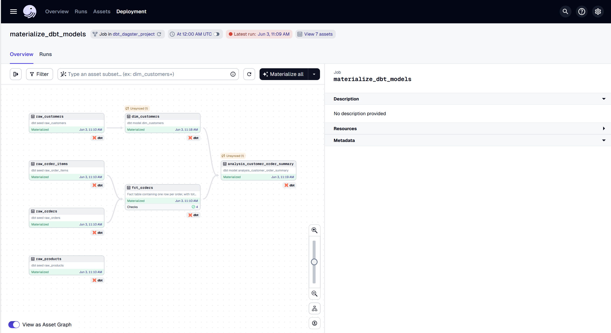

# Dagster + dbt Data Pipeline

This project demonstrates how to orchestrate a data transformation pipeline using **Dagster** and **dbt**, with data stored in **PostgreSQL**.

## 📦 Project Overview

- **dbt** is used to:
  - Seed raw data
  - Transform raw tables into dimensional and fact tables
  - Create analytical summaries
- **Dagster** orchestrates the dbt models as assets
- **PostgreSQL** serves as the database backend

## 🛠 Components

- **dbt models**:
  - `raw_customers`, `raw_orders`, `raw_order_items`, `raw_products`
  - `dim_customers`, `fct_orders`
  - `analysis_customer_order_summary`
  
- **Dagster job**: `materialize_dbt_models`
  - Runs dbt seed and model transformations
  - Materializes assets based on dbt models

## 🖥 Local Execution

To run Dagster on your local machine:

```bash
docker-compose up --build
```
## Running the App

After starting the application, you can access it in your browser at:

[http://localhost:3000](http://localhost:3000)

Make sure the app is running (e.g., via `docker-compose up` ) before opening the link.

## Screenshots

Here is an example screenshot from the project:


